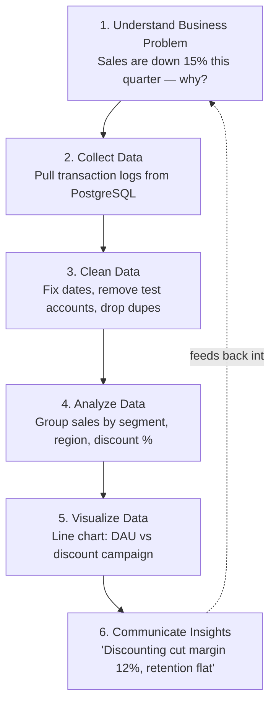

# The Professional Data Analyst Workflow 

> **The end-to-end operational framework for conducting rigorous, repeatable, high-impact business analysis.**

---

## 🔄 The 6-Step Data Analyst Core Workflow



| Step | Phase | What Happens | Real-World Example |
|:---:|:---|:---|:---|
| **1** | **Understand Business Problem** | Define the goal, constraints, and success criteria with stakeholders | Sales are down 15% this quarter. Why? |
| **2** | **Collect Data** | Gather data from internal databases (SQL), CSVs, APIs, or web sources | Pull transaction logs from PostgreSQL for Q1 & Q2 |
| **3** | **Clean Data** | Fix missing values, wrong data types, typos, duplicates, and outliers | Convert string dates to YYYY-MM-DD, remove test accounts |
| **4** | **Analyze Data** | Run statistical summaries, segmentation, trend analysis, correlations | Group sales by customer segment, region, and discount % |
| **5** | **Visualize Data** | Build clear charts, tables, and dashboards to display patterns | Line chart of daily active users vs discount campaign launch |
| **6** | **Communicate Insights** | Tell a story with data and recommend specific actions | "Heavy discounting reduced margin by 12% without increasing retention." |

---

## 💡 Worked Example — Walking Through All 6 Steps

Imagine you work at a small e-commerce store and get handed this raw sales snippet:

```csv
order_id, order_date,   customer_id, region,  discount_pct, revenue
1001,     2026-07-01,   C-45,        North,   10,           2400
1002,     07/02/2026,   C-12,        South,   0,             800
1003,     2026-07-03,   c-45,        north,   25,           1900
1004,     2026-07-03,   ,            South,   30,             NaN
1005,     2026-07-04,   C-89,        East,    10,           3100
```

- **Step 1 — Understand:** Stakeholder says *"revenue feels lower than last month even though we ran more discounts — investigate."*
- **Step 2 — Collect:** This is the raw pull from the `orders` table.
- **Step 3 — Clean:** Standardize `order_date` formats, lowercase `region`/`customer_id` values so `C-45` and `c-45` aren't treated as different customers, drop or flag the row with a missing `customer_id` and `NaN` revenue.
- **Step 4 — Analyze:** Group by `discount_pct` and compute average revenue per order — you find orders with 25–30% discount tend to have lower or missing revenue, hinting discounts may be eating margin.
- **Step 5 — Visualize:** A simple bar chart of *Average Revenue by Discount Bracket* makes the pattern obvious at a glance instead of scanning rows.
- **Step 6 — Communicate:** *"Orders with 25%+ discounts show the weakest revenue contribution — recommend capping discounts at 15% for the North region next cycle."*

---

## 📋 Detailed 7-Stage Analyst Execution Lifecycle

```text
1. BUSINESS UNDERSTANDING & PROBLEM FRAMING
        ↓
2. HYPOTHESIS FORMULATION
        ↓
3. DATA RECONNAISSANCE & QUALITY AUDIT
        ↓
4. DATA EXTRACTION & MANIPULATION (SQL / Pandas / Excel)
        ↓
5. RIGOROUS ANALYSIS (EDA, Cohort, Funnel, Stats)
        ↓   
6. INSIGHT SYNTHESIS & STORYTELLING
        ↓
7. RECOMMENDATION & STAKEHOLDER DECISION
```

### Stage 1: Business Framing & Stakeholder Alignment
* Identify the target stakeholder (e.g., VP of Sales, Head of Product).
* Clarify the underlying business decision: *What action will be taken based on the output?*

### Stage 2: Hypothesis Formulation
* Draft explicit, falsifiable hypotheses prior to querying:
  *Example*: *"User drop-off at checkout step 2 is caused by unexpected shipping cost additions, affecting high-cart-value users."*

### Stage 3: Data Reconnaissance & Quality Audit
* Locate exact tables and verify **table grain** (*What does one row represent?*).
* Perform data sanity checks (check for duplicates, NULL values, impossible dates, outlier spikes).

### Stage 4: Extraction & Manipulation
* Write clean SQL CTEs or Pandas workflows. Validate row counts after JOIN operations.

### Stage 5: Rigorous Analysis
* Break down overall metrics across customer segments, time cohorts, geography, and acquisition channels.
* Differentiate correlation from true causal drivers.

### Stage 6: Insight Synthesis & Storytelling
* Format findings using the **5 Core Analytical Questions**:
  1. What happened?
  2. Why did it happen?
  3. Why does it matter?
  4. What should we do?
  5. What happens if we do nothing?

### Stage 7: Action & Tracking
* Present actionable recommendations with trade-offs. Track business outcomes post-implementation.  
